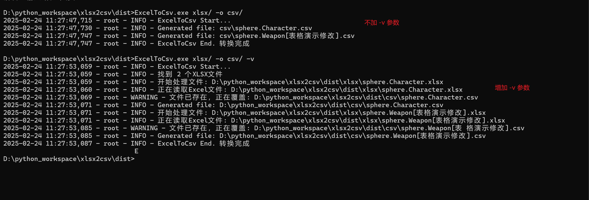

# Xlsx2Csv

该项目是一个将 Excel 文件转换为 CSV 文件的工具，使用 Python 编写，使用 PyInstaller 打包。



## 功能特性

### 1. 多模式输入支持:
 * ✅ 支持单个文件、目录批量转换、通配符模式匹配
 * ✅ 自动忽略 Excel 临时文件（~$ 开头的文件）

### 2. 灵活的工作表处理
 * ✅ 默认转换第一个工作表
 * ✅ 支持转换所有工作表（-a 参数）
 * ✅ 支持按名称或索引指定工作表

### 3. 丰富的输出控制
 * ✅ 自定义输出目录
 * ✅ 可选 CSV 分隔符（默认逗号）
 * ✅ 支持多种编码格式（默认 UTF-8-BOM）
 * ✅ 防止文件覆盖（-nf 参数）
### 4. 增强特性

 * ✅ 布尔值自动转为大写字符串
 * ✅ 中英文提示切换（-c 参数）
 * ✅ 详细日志输出（-v 参数）
 * ✅ 自定义日志格式支持

## 安装使用

### 环境要求
 * Python 3.6+
 * 依赖库：openpyxl

```bash
pip install openpyxl
```

### 快速开始

```bash
# 转换单个文件（默认输出到当前目录）
python easy_xlsx_to_csv.py input.xlsx

# 转换目录下所有xlsx文件
python easy_xlsx_to_csv.py /path/to/excels/ -o ./output/

# 使用通配符匹配文件
python easy_xlsx_to_csv.py "./data/*.xlsx" -o ./csv_output/
```


## 参数说明

| 参数            | 描述                     | 默认值         |
|-----------------|--------------------------|----------------|
| `input`         | 输入路径（文件/目录/通配符） | 必填           |
| `-o, --output`  | 输出目录                 | `./`           |
| `-s, --sheet`   | 工作表名称/索引          | `0`            |
| `-d, --delimiter` | CSV 分隔符              | `,`            |
| `-e, --encoding` | 输出文件编码            | `utf-8-sig`    |
| `--no-header`   | 不包含标题行             | `False`        |
| `--index`       | 包含索引列               | `False`        |
| `-nf, --no-force` | 禁止覆盖已有文件       | `False`        |
| `-v, --verbose` | 显示详细日志             | `False`        |
| `-c, --chinese` | 显示中文提示             | `False`        |
| `-a, --all-sheets` | 转换所有工作表        | `False`        |
| `-f, --logformat` | 自定义日志格式         | `%(message)s`  |

## 使用示例

### 基础转换
```bash
# 转换单个文件，中文提示
python easy_xlsx_to_csv.py input.xlsx -c

# 转换并指定分隔符为分号
python easy_xlsx_to_csv.py data.xlsx -d ";"
```


### 批量处理

```bash
# 转换目录下所有Excel文件到output目录
python easy_xlsx_to_csv.py ./excels/ -o ./output/ -v
```


## 注意事项

 1. 默认跳过以 ~$ 开头的 Excel 临时文件

 2. 当输出文件已存在时：

 3. 默认覆盖（除非使用 -nf 参数）

 4. 多工作表转换时会追加工作表名称后缀


* 项目源码：[\[GitHub仓库地址\]](https://github.com/super999/xlsx2csv)
* 报告问题：[Issues页面](https://github.com/super999/xlsx2csv/issues)
* 版本更新：v1.0 - 2025年2月24日


### 打包命令

使用 PyInstaller 将脚本打包为可执行文件：

```bash
# 使用命令行直接打包
pyinstaller --name ExcelToCsv --onefile --console easy_xlsx_to_csv.py --upx-dir=D:/python_workspace/xlsx2csv/upx

# 或者使用 spec 文件打包
pyinstaller ExcelToCsv.spec
```